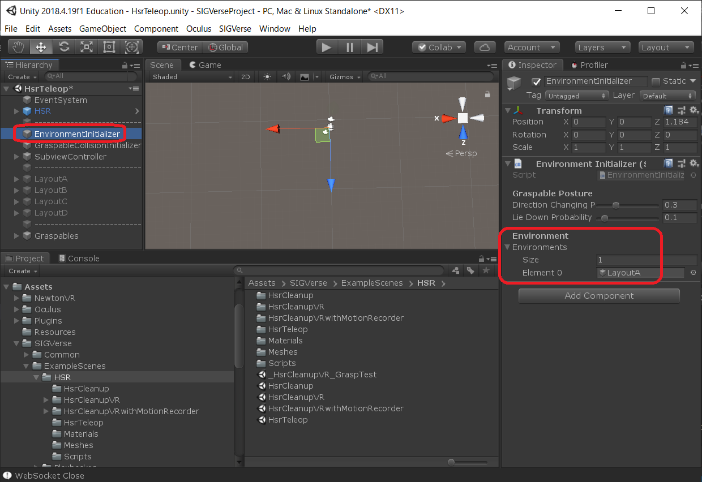
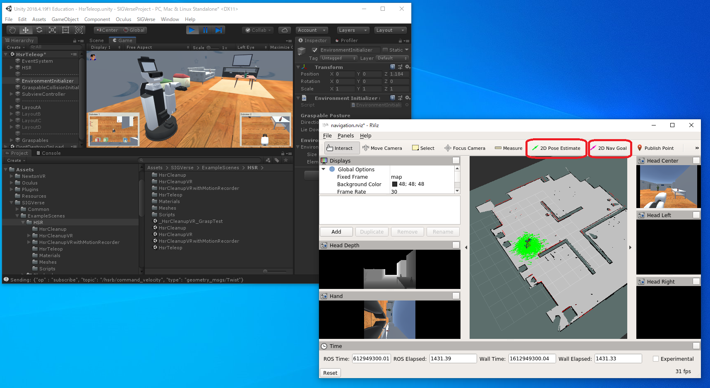

# oit_sigverse_ros

## Requirements

- Unity 2018.4.19
- [SIGVerse](https://github.com/SIGVerse/sigverse_unity_project)
- [sigverse_ros_package](https://github.com/SIGVerse/sigverse_ros_package)

See [SIGVerse Tutorial](http://www.sigverse.org/wiki/jp/?Tutorial%20for%20ver.3) and [Tutorial using ROS for ver.3](http://www.sigverse.org/wiki/jp/?Tutorial%20using%20ROS%20for%20ver.3) for more details.

## Install

```shell
$ cd ~/catkin_ws/src
$ git clone https://github.com/KMiyawaki/oit_sigverse_ros.git
$ git clone https://github.com/KMiyawaki/oit_pbl_maps.git
$ cd ~/catkin_ws && catkin_make
```

## Set SIGVerse Layout

- Open sigverse_unity_project with Unity.
- Open `Assets/SIGVerse/ExampleScenes/HSR/HsrTeleop.unity`
- Select `EnvironmentInitializer` from object hierarchy.
- Set `Environment/Size` to 1 and set `Element0` to `LayoutA`.



## Launch navigation

Type following command in Ubuntu terminal.

```shell
$ roslaunch oit_sigverse_ros navigation.launch
```

Push play button in Unity Editor, and you can see HSR's virtual camera images in RViz.  
Use `2D Pose Estimate` button for AMCL localization and set navigation goal by `2D Nav Goal` button.


